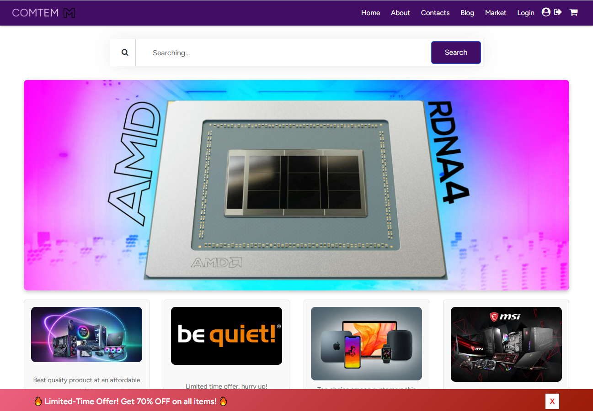
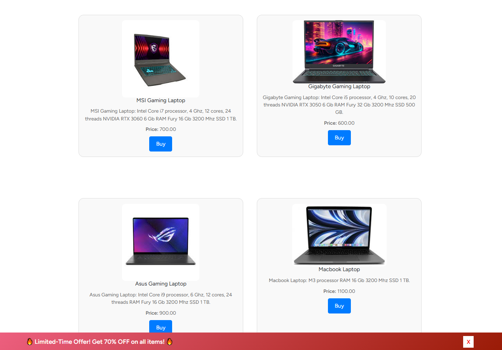
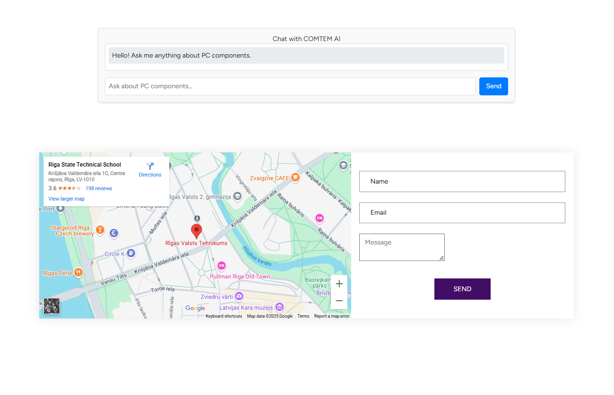
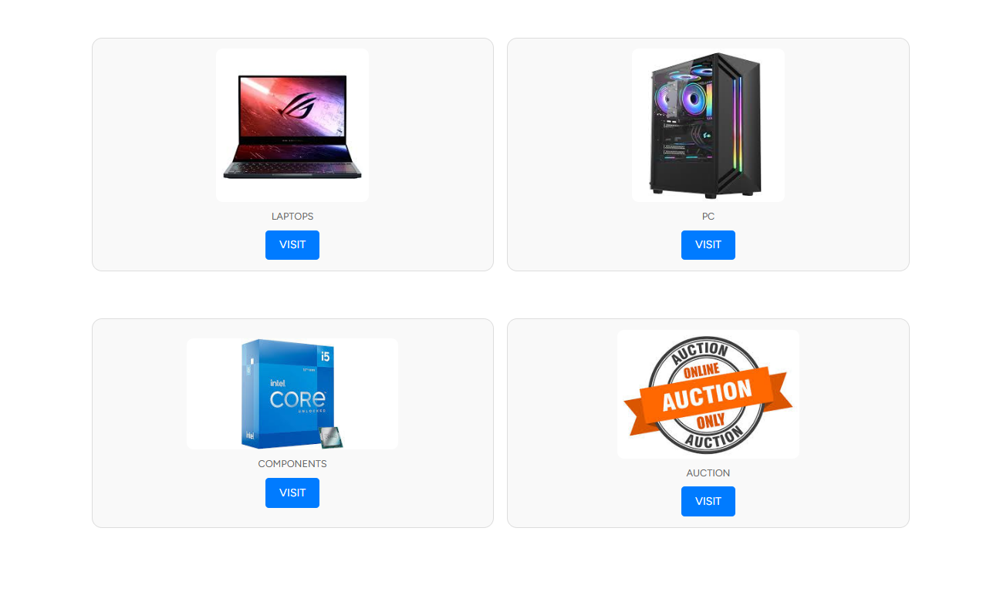

# COMTEM
## Computer Tech Market 

  

 

  

[LV]
Projekta galvenā ideja ir izveidot lietotājam draudzīgu, 
ātru un drošu e-komercijas platformu, kas specializējas datoru, 
laptopu un komponentu pārdošanā. Šī platforma nodrošina personalizētu 
iepirkšanās pieredzi ar plašu preču katalogu, izsoli, emuāru, kurā 
lietotājs var atrast izglītojošus materiālus par datortehnikas 
lietošanu, kā arī virtuālo asistentu (mākslīgais intelekts) un 
lietotāju atbalstu. Projekts izmanto Laravel(PHP) un Vue.js, 
MySQL kā tehnoloģisko bāzi, 
kas nodrošina augstu veiktspēju un pielāgojamību.

[EN]
The main idea of the project is to create a user-friendly,
fast and secure e-commerce platform specializing in the sale of computers,
laptops and components. This platform provides a personalized
shopping experience with an extensive product catalog, an auction, a blog where the
user can find educational materials on the use of computer equipment, as well as virtual assistants (artificial intelligence) and
user support. The project uses Laravel(PHP) and Vue.js,
MySQL as a technological base,
which ensures high performance and scalability.

### Gallery

### How to use

1. Clone repo to xampp/htdocs/..
2. Install npm and composer
3. Install other needed packages (vue)
4. Run php artisan migrate
5. Run php artisan serve

(You need to open xampp and run apache and mesql servers, then 
create new db in the phpmyadmin and connect it in the env file)

**Authors: Daniils Onufrijuks aka daniilsonufrijuks **